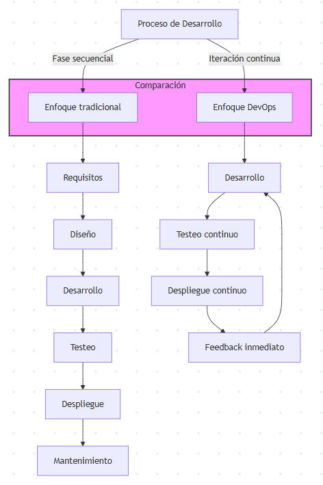

# Actividad 1 - Introducción a DevOps y DevSecOps

**Nombre:** Martin Centeno Leon  
**Fecha:** Setiembre del 2025  

---

## Contexto del Entorno

Esta actividad se realizó en un entorno de desarrollo personal utilizando una máquina local con Ubuntu. Se configuraron herramientas estándar como navegadores para realizar inspecciones de red, comandos de terminal como `curl` y `dig`, y herramientas gratuitas para la creación de diagramas como Excalidraw. La actividad no implicó el uso de servicios o entornos de producción reales.

---

## 4.1 DevOps vs. Cascada Tradicional

### Comparación

DevOps es una metodología moderna que se caracteriza por la **integración continua** (CI), la **entrega continua** (CD) y la **automatización de pruebas**. A diferencia de la cascada tradicional, que sigue un proceso lineal y secuencial, DevOps promueve **ciclos de retroalimentación rápida** y permite realizar cambios más pequeños, frecuentes y menos riesgosos. 

#### Ciclos de Feedback y Reducción de Riesgo

DevOps permite reducir los riesgos asociados con el software en la nube debido a la **automatización** y el **feedback continuo**. Al aplicar **cambios pequeños** con **pruebas automatizadas**, se detectan problemas más rápidamente y se pueden resolver sin afectar todo el sistema.

#### Contextos donde la Cascada sigue siendo Razónable

En algunos contextos, un enfoque cercano a cascada sigue siendo razonable. Por ejemplo, en sistemas con **certificaciones regulatorias estrictas** o aquellos con un **fuerte acoplamiento a hardware**. Estos sistemas requieren pruebas exhaustivas antes de cualquier despliegue.

**Criterios verificables**:
- **Regulaciones estrictas**: Los sistemas deben cumplir con estándares de seguridad, como los de la industria farmacéutica o aeronáutica.
- **Seguridad y conformidad**: La necesidad de garantizar que cada cambio cumpla con normas estrictas de seguridad y validación de pruebas.

**Trade-offs**:
- **Velocidad vs. Conformidad**: Mientras que DevOps prioriza la velocidad, la cascada favorece la conformidad y el cumplimiento de estándares.

---

## 4.2 Ciclo Tradicional de Dos Pasos y Silos

### Limitaciones del Ciclo Tradicional

El ciclo tradicional de desarrollo ("construcción -> operación") sin integración continua tiene varias limitaciones:
- **Grandes lotes**: En lugar de realizar entregas pequeñas y frecuentes, los equipos trabajan en grandes lotes, lo que lleva a retrasos en la identificación y corrección de errores.
- **Colas de defectos**: Los errores y defectos se acumulan, lo que genera cuellos de botella y retrabajo al final del ciclo.

### Anti-patrones

- **"Throw over the wall"**: Este anti-patrón ocurre cuando los equipos de desarrollo y operaciones no se comunican efectivamente, lo que lleva a que los defectos no se detecten hasta que el producto es entregado.
- **Seguridad como auditoría tardía**: Implementar prácticas de seguridad solo al final del ciclo de vida del software, lo que aumenta el riesgo de vulnerabilidades críticas no detectadas.

---

## 4.3 Principios y Beneficios de DevOps

### CI/CD y Automatización

**Integración Continua (CI)** y **Entrega Continua (CD)** permiten que los desarrolladores integren su código frecuentemente y que ese código sea probado y desplegado de manera automática. Esto reduce significativamente los riesgos de errores en producción.

La **automatización** de pruebas y la colaboración cercana entre los equipos de desarrollo y operaciones son fundamentales para garantizar un ciclo de desarrollo ágil y eficiente.

### Indicador Observable para Medir Colaboración DevOps

Un indicador clave para medir la colaboración en un entorno DevOps podría ser el **tiempo desde que un Pull Request (PR)** está listo hasta que se despliega en el entorno de pruebas. Este indicador es útil porque mide cuán rápido el equipo de desarrollo y el equipo de operaciones pueden colaborar para llevar los cambios a un entorno donde se pueda validar su efectividad.

Para recolectar este indicador, se pueden usar **bitácoras de PRs** y **registros de despliegue**, sin necesidad de herramientas pagas.

---

## 4.4 Evolución a DevSecOps

### Diferencias entre SAST y DAST

**SAST (Static Application Security Testing)** realiza análisis de seguridad en el código fuente, permitiendo encontrar vulnerabilidades antes de que el código se ejecute.  
**DAST (Dynamic Application Security Testing)** evalúa la seguridad de una aplicación mientras está en ejecución, detectando vulnerabilidades en tiempo real.

### Gate Mínimo de Seguridad

1. **Umbral 1**: Cualquier hallazgo crítico de seguridad debe **bloquear la promoción a producción**.
2. **Umbral 2**: La cobertura mínima de pruebas de seguridad debe ser del **80%** en las rutas críticas de la API, como autenticación y pagos.

**Política de Excepción**:
- Si se encuentra una vulnerabilidad crítica no corregible, se puede otorgar una **excepción por 7 días**. Durante este tiempo, el equipo debe aplicar un **parche de mitigación**, como el uso de un **WAF** (Web Application Firewall), y reevaluar la situación al finalizar los 7 días.

**Evitar el "Teatro de Seguridad"**:
- **Señales de eficacia**:  
  1. **Reducción de hallazgos repetidos** en las siguientes rondas de escaneo.
  2. **Tiempo de remediación** de vulnerabilidades críticas ≤ 48 horas.

---

## 4.5 CI/CD y Estrategias de Despliegue

### Estrategia de Despliegue: Canary

Para un microservicio crítico como **autenticación**, se recomienda utilizar una estrategia **Canary**. Esto significa que el servicio se despliega primero en una pequeña parte del sistema (por ejemplo, el 10% de los usuarios) antes de ser liberado completamente. Esto ayuda a reducir el impacto de posibles errores.

### Riesgos vs. Mitigaciones

| Riesgo                         | Mitigación                             |
| ------------------------------ | --------------------------------------- |
| **Regresión funcional**         | Validación de contrato antes de promover. |
| **Costo operativo de doble despliegue** | Limitar el tiempo de convivencia de ambos despliegues. |
| **Manejo de sesiones**          | Implementar "draining" y compatibilidad de esquemas. |

### KPI Primario

El **KPI primario** podría ser la tasa de errores **5xx**, donde el umbral debe ser **≤ 0.1%** durante la primera hora después del despliegue.

---

## 4.6 Fundamentos Prácticos sin Comandos (Evidencia Mínima)

### HTTP - Contrato Observable

**Captura**: `imagenes/http-evidencia.png`

En esta captura se observa el **método HTTP** (GET), el **código de estado** (200) y las cabeceras relevantes, como **Cache-Control** y **X-Request-ID**. Estas cabeceras son esenciales para el rendimiento y la trazabilidad de las solicitudes.

### DNS - Nombres y TTL

**Captura**: `imagenes/dns-ttl.png`

En esta captura se muestra el **TTL** de un dominio, lo cual es importante para el manejo de rollbacks y la propagación de cambios en la dirección IP de un servidor.

### TLS - Seguridad en Tránsito

**Captura**: `imagenes/tls-cert.png`

Aquí se presenta el **CN** (Common Name) y el **SAN** (Subject Alternative Name) de un certificado, así como su **vigencia** y **emisora**, lo cual es crucial para validar la seguridad en el tránsito de datos.

---

## 4.7 Desafíos de DevOps y Mitigaciones

### Desafíos

**Desafío 1**: La integración continua en un entorno de trabajo aislado.  
**Desafío 2**: La falta de una cultura organizacional que favorezca la colaboración.  
**Desafío 3**: La gestión de infraestructuras complejas.

### Riesgos y Mitigaciones

| Riesgo                         | Mitigación                             |
| ------------------------------ | --------------------------------------- |
| **Rollback**                    | Implementar un proceso de reversión automático. |
| **Despliegues graduales**       | Realizar despliegues en etapas (canary, azul/verde). |
| **Revisión cruzada**            | Asegurar que los cambios pasen por revisiones de pares. |

---

## 4.8 Arquitectura Mínima para DevSecOps

### Flujo de Cliente a Servicio Seguro

**Captura**: `imagenes/arquitectura-minima.png`

Este diagrama muestra el flujo de un cliente que realiza una solicitud a través de DNS, hacia un servicio HTTP protegido con TLS. Se aplican controles en cada capa para garantizar un despliegue seguro y reproducible.

---

## 5) Evidencias

En esta sección, se muestran las capturas de las evidencias recolectadas en las comprobaciones realizadas:

1. **HTTP - Método, código y cabeceras**:  
   **Captura**: `imagenes/http-evidencia.png`

2. **DNS - Tipo de registro y TTL**:  
   **Captura**: `imagenes/dns-ttl.png`

3. **TLS - CN/SAN, vigencia y emisora**:  
   **Captura**: `imagenes/tls-cert.png`

4. **Puertos - Estado de runtime**:  
   **Captura**: `imagenes/puertos.png`

---

## 6) FUENTES

1. [Fuente 1: Introducción a DevOps](https://www.atlassian.com/devops)
2. [Fuente 2: DevSecOps en la práctica](https://www.redhat.com/devsecops)
