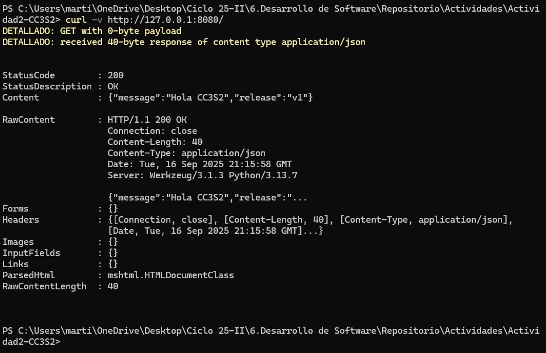
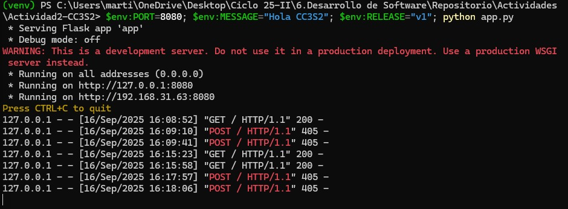
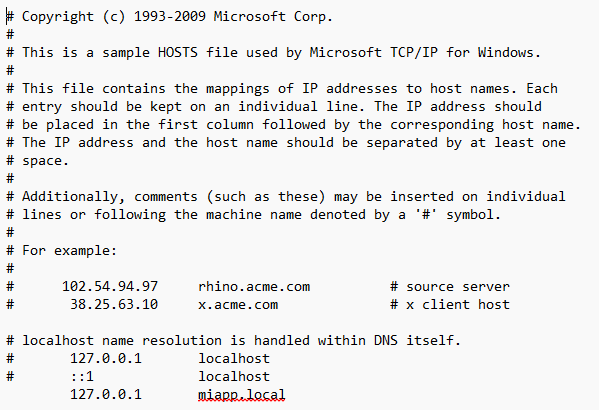
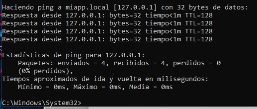

# Actividad 2: HTTP, DNS, TLS y 12-Factor (port binding, configuración, logs)

## Objetivo

El objetivo de esta actividad es practicar despliegues seguros y reproducibles combinando aplicaciones (HTTP), resolución de nombres (DNS), cifrado en tránsito (TLS), y buenas prácticas **12-Factor** (variables de entorno, port binding y logs a stdout).

## Archivos

- **`app.py`**: Aplicación Flask que expone una API en el puerto configurado por la variable de entorno `PORT`. Responde con un mensaje y versión definidos por las variables de entorno `MESSAGE` y `RELEASE`.
- **`Makefile`** (opcional): Contiene comandos para facilitar la ejecución de configuraciones en entornos Linux o WSL.
- **`REPORT.md`**: Reporte con evidencias de las pruebas realizadas y respuestas a las preguntas guía.
- **Capturas de pantalla**: Archivos de imagen que muestran la terminal con la salida de las pruebas.

## Requisitos previos

1. Tener **Python 3** instalado en tu máquina.
2. Crear un entorno virtual y activar el entorno virtual (opcional pero recomendado).
3. Instalar las dependencias de Flask con `pip install flask`.
4. Para realizar la parte de TLS, necesitarás tener instalado **Nginx** y **OpenSSL**.

## Instrucciones

### Levantar la aplicación

1. **Crear el entorno virtual (opcional):**

    ```bash
    python -m venv venv
    .\venv\Scripts\activate  # En PowerShell
    ```

2. **Instalar Flask**:

    ```bash
    pip install flask
    ```

3. **Ejecutar la aplicación Flask** con las variables de entorno:

    ```bash
    $env:PORT=8080; $env:MESSAGE="Hola CC3S2"; $env:RELEASE="v1"; python app.py  # En PowerShell
    ```

4. La aplicación debería estar disponible en `http://127.0.0.1:8080/` o `http://192.168.x.x:8080`.

### Pruebas con `curl`

- **Ver respuesta GET:**

    ```bash
    curl -v http://127.0.0.1:8080/
    ```

- **Ver respuesta POST sin ruta definida:**

    ```bash
    curl -i -X POST http://127.0.0.1:8080/
    ```

### DNS

1. Agrega el siguiente registro en tu archivo de hosts para simular la resolución de `miapp.local`:

    ```
    127.0.0.1 miapp.local
    ```

2. Verifica la resolución con `dig` o `getent`:

    ```bash
    dig +short miapp.local
    ```

### TLS con Nginx

1. **Generar certificado autofirmado (si no tienes uno)**:

    ```bash
    openssl genpkey -algorithm RSA -out server.key
    openssl req -new -key server.key -out server.csr
    openssl x509 -req -days 365 -in server.csr -signkey server.key -out server.crt
    ```

2. Configura Nginx para la terminación de TLS y proxy a Flask en `127.0.0.1:8080`.

    ```nginx
    server {
        listen 443 ssl;
        server_name miapp.local;

        ssl_certificate /path/to/server.crt;
        ssl_certificate_key /path/to/server.key;

        location / {
            proxy_pass http://127.0.0.1:8080;
            proxy_set_header X-Forwarded-For $remote_addr;
            proxy_set_header X-Forwarded-Proto $scheme;
            proxy_set_header X-Forwarded-Host $host;
        }
    }
    ```

3. **Verificar TLS con OpenSSL:**

    ```bash
    openssl s_client -connect miapp.local:443 -servername miapp.local -brief
    ```

---

## Preguntas guía

1. **HTTP**: La idempotencia significa que un método puede repetirse sin alterar el estado del servidor. `PUT` reemplaza un recurso mientras que `POST` crea un nuevo recurso cada vez.

2. **DNS**: El archivo `/etc/hosts` es útil para pruebas locales y laboratorio porque no requiere un servidor DNS, mientras que una zona DNS autoritativa es adecuada para producción porque puede manejar muchas resoluciones de nombres a través de un servidor DNS.

3. **TLS**: SNI (Server Name Indication) permite a un servidor manejar múltiples certificados SSL en una misma IP. Lo verificamos con `openssl s_client`.

4. **12-Factor**: Los logs a stdout y la configuración por entorno permiten que la app sea fácilmente portable y escalable, especialmente en contenedores y pipelines de CI/CD.

5. **Operación**: `ss -ltnp` muestra información detallada de los puertos y los procesos que no verías con `curl`. Los logs de Nginx permiten identificar problemas de configuración.

---

## Capturas de pantalla

### 1. Captura de la salida de `curl` al acceder a la aplicación Flask
Esta captura muestra cómo la aplicación Flask responde a la solicitud GET desde `curl` en la dirección `http://127.0.0.1:8080/`.



### 2. Captura del error al intentar usar el método POST en la aplicación Flask
Se muestra el error recibido al intentar hacer una solicitud POST sin la ruta correspondiente.



### 3. Captura de la respuesta exitosa del `ping` a `miapp.local`
Este `ping` confirma que `miapp.local` se resolvió correctamente a `127.0.0.1`, indicando que el archivo **hosts** está configurado correctamente.



### 4. Captura de la configuración del archivo **hosts**
Aquí se muestra cómo se configuró el archivo **hosts** en Windows para resolver `miapp.local` a `127.0.0.1`.


