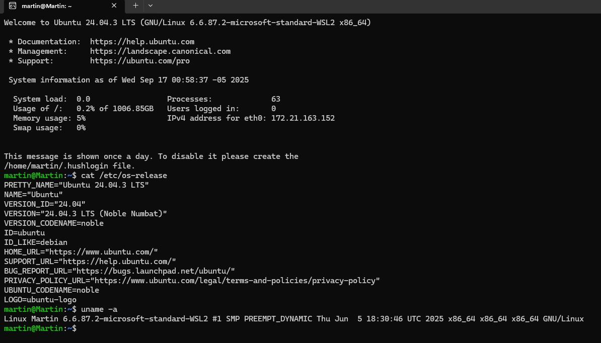
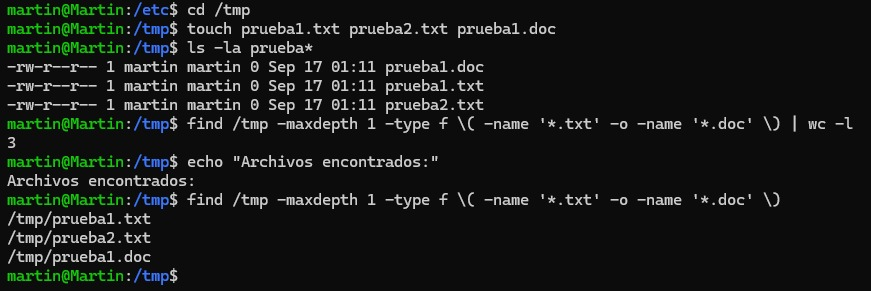
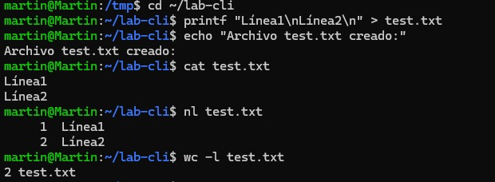
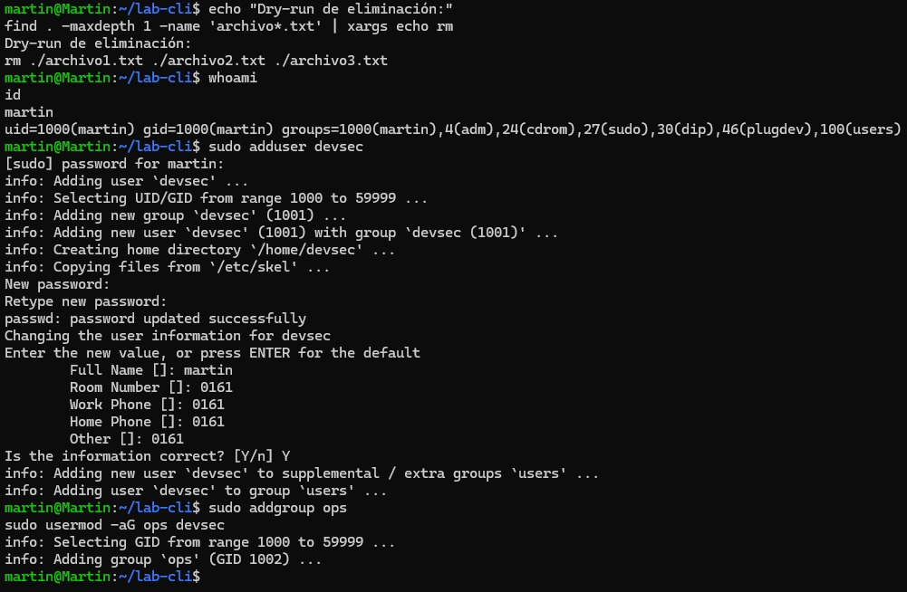
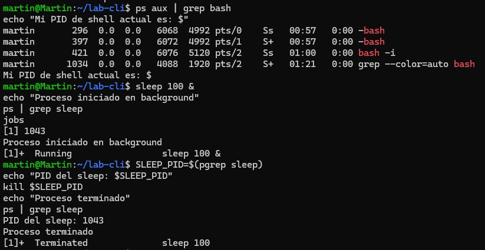
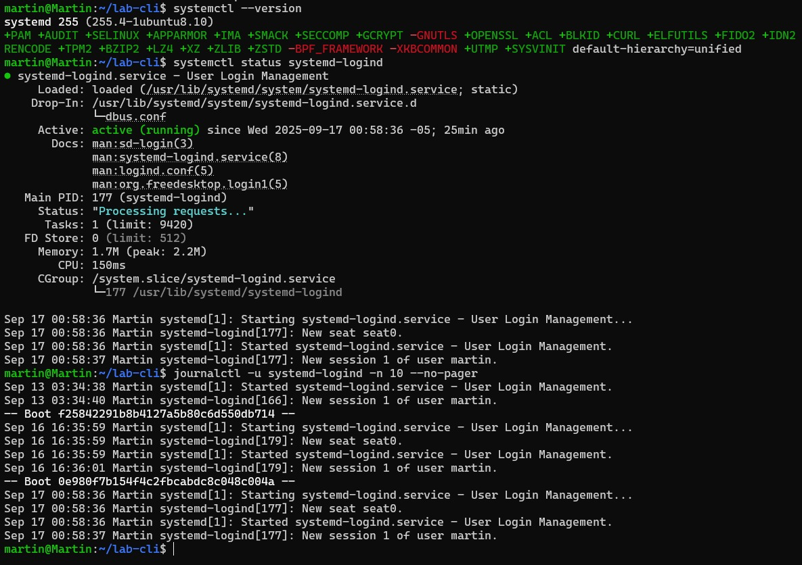
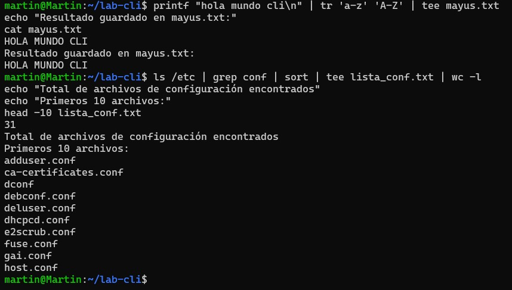
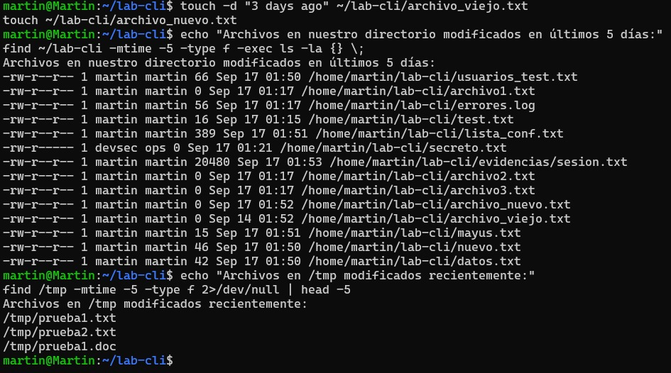
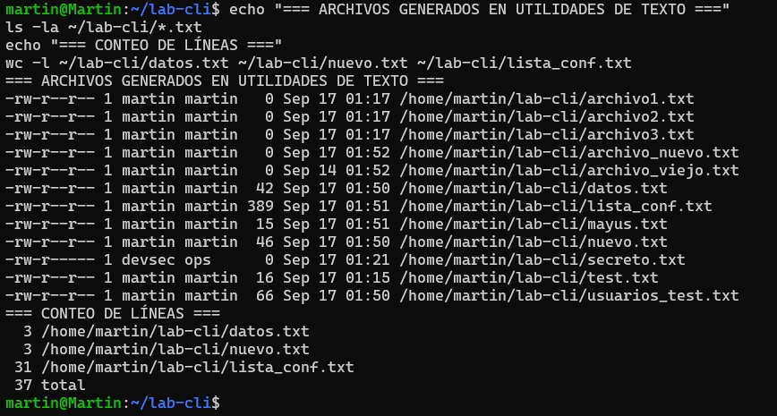

# Actividad 4: Introducción a herramientas CLI en entornos Unix-like para DevSecOps

## Información del Estudiante
- **Nombre:** Martin Alonso Centeno Leon
- **Curso:** CC3S2
- **Fecha:** Setiembre del 2025

## Descripción
Este laboratorio se enfoca en el manejo de la línea de comandos (CLI) en sistemas Unix-like con orientación a DevSecOps. Se divide en tres secciones principales: Manejo sólido de CLI, Administración básica, y Utilidades de texto de Unix.

## Configuración del Entorno
- **Sistema Operativo:** [Ubuntu/macOS/WSL2]
- **Terminal:** [Terminal utilizada]
- **Versión del sistema:** 
```bash
cat /etc/os-release
```

## Sección 1: Manejo sólido de CLI

### Ejercicio 1: Navegación en /etc
**Comando ejecutado:**
```bash
cd /etc
ls -a > ~/etc_lista.txt
```

**Explicación:** Navegué al directorio `/etc`, listé todos los archivos (incluyendo ocultos) y redirigí la salida a un archivo en el home.

**Captura de pantalla:**


### Ejercicio 2: Globbing y conteo de archivos
**Comando ejecutado:**
```bash
find /tmp -maxdepth 1 -type f \( -name '*.txt' -o -name '*.doc' \) | wc -l
```

**Explicación:** Utilicé `find` para buscar archivos con extensiones .txt y .doc en /tmp y conté el total con `wc -l`.

**Resultado:** [Número de archivos encontrados]

**Captura de pantalla:**


### Ejercicio 3: Creación de archivo con printf
**Comando ejecutado:**
```bash
printf "Línea1\nLínea2\n" > test.txt
```

**Verificación:**
```bash
nl test.txt
```

**Captura de pantalla:**


### Ejercicio 4: Manejo de errores y xargs
**Comando ejecutado:**
```bash
ls noexiste 2>> errores.log
find . -maxdepth 1 -name 'archivo*.txt' | xargs echo rm
```

**Explicación:** Redirigí errores a un archivo de log y usé xargs con echo para hacer un dry-run del comando rm.

**Captura de pantalla:**


## Sección 2: Administración básica

### Ejercicio 1: Gestión de usuarios y permisos
**Comandos ejecutados:**
```bash
sudo adduser devsec
sudo addgroup ops
sudo usermod -aG ops devsec
touch secreto.txt
sudo chown devsec:ops secreto.txt
sudo chmod 640 secreto.txt
```

**Verificación:**
```bash
namei -l secreto.txt
id devsec
```

**Explicación:** Creé un usuario 'devsec', un grupo 'ops', asigné el usuario al grupo y configuré permisos restrictivos en un archivo.

**Captura de pantalla:**


### Ejercicio 2: Gestión de procesos
**Comandos ejecutados:**
```bash
ps aux | grep bash
sleep 100 &
ps
kill [PID]
```

**Explicación:** Identifiqué procesos bash, inicié un proceso en background y lo terminé usando su PID.

**Captura de pantalla:**


### Ejercicio 3: Servicios y logs con systemd
**Comandos ejecutados:**
```bash
systemctl status systemd-logind
journalctl -u systemd-logind -n 10
```

**Explicación:** Verifiqué el estado del servicio systemd-logind y revisé sus últimos 10 registros de log.

**Captura de pantalla:**


## Sección 3: Utilidades de texto de Unix

### Preparación de archivos de prueba
**Comandos ejecutados:**
```bash
# Crear archivos de datos para las pruebas
printf "linea1: dato1\nlinea2: dato2\nlinea3: dato1\n" > datos.txt
printf "usuario1:password123:1001\nusuario2:secret456:1002\nroot:admin789:0\n" > usuarios_test.txt
```

### Ejercicio Combinado: Herramientas de procesamiento de texto

**Comandos ejecutados:**
```bash
# 1. Búsqueda con grep
grep root /etc/passwd
grep -n "dato1" datos.txt

# 2. Sustitución con sed
sed 's/dato1/secreto/g' datos.txt > nuevo.txt
echo "=== Comparación original vs modificado ==="
echo "Original:"; cat datos.txt
echo "Modificado:"; cat nuevo.txt

# 3. Extracción con awk y cut
echo "Usuarios del sistema (primeros 10):"
awk -F: '{print $1}' /etc/passwd | head -10
echo "Comparando awk vs cut:"
awk -F: '{print $1}' usuarios_test.txt
cut -d: -f1 usuarios_test.txt

# 4. Transformación y pipeline completo
printf "hola mundo cli\n" | tr 'a-z' 'A-Z' | tee mayus.txt
echo "Resultado guardado en mayus.txt:"
cat mayus.txt

# 5. Pipeline avanzado - archivos de configuración
ls /etc | grep conf | sort | tee lista_conf.txt | wc -l
echo "Total de archivos de configuración encontrados"
echo "Primeros 10 archivos:"
head -10 lista_conf.txt
```

**Explicación:** Este conjunto de comandos demuestra el uso integrado de las principales herramientas de texto Unix:
- **grep**: Para buscar patrones específicos en archivos del sistema y archivos de prueba
- **sed**: Para sustituir texto preservando el archivo original
- **awk y cut**: Para extraer campos específicos, mostrando diferentes enfoques
- **tr y tee**: Para transformación de texto y salida dual (pantalla + archivo)
- **Pipeline completo**: Combinando múltiples herramientas para procesar y contar archivos

**Captura de pantalla:**


### Ejercicio de búsqueda avanzada con find
**Comando ejecutado:**
```bash
# Crear archivos de diferentes fechas para la prueba
touch -d "3 days ago" ~/lab-cli/archivo_viejo.txt
touch ~/lab-cli/archivo_nuevo.txt

# Buscar archivos modificados recientemente
echo "Archivos en nuestro directorio modificados en últimos 5 días:"
find ~/lab-cli -mtime -5 -type f -exec ls -la {} \;

echo "Archivos en /tmp modificados recientemente:"
find /tmp -mtime -5 -type f 2>/dev/null | head -5
```

**Explicación:** Uso de `find` para localizar archivos por criterios temporales, fundamental para auditoría de cambios en sistemas.

**Captura de pantalla:**


### Verificación de archivos generados
**Comando ejecutado:**
```bash
echo "=== ARCHIVOS GENERADOS EN UTILIDADES DE TEXTO ==="
ls -la ~/lab-cli/*.txt
echo "=== CONTEO DE LÍNEAS ==="
wc -l ~/lab-cli/datos.txt ~/lab-cli/nuevo.txt ~/lab-cli/lista_conf.txt
```

**Captura de pantalla:**
